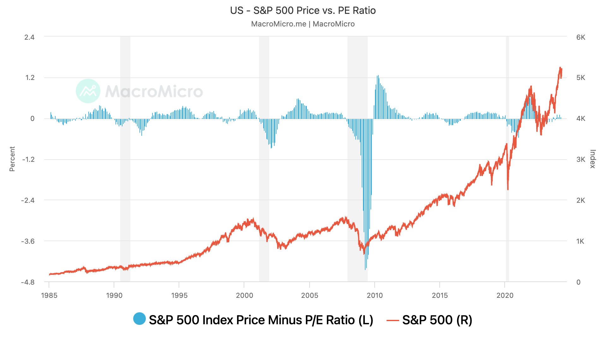
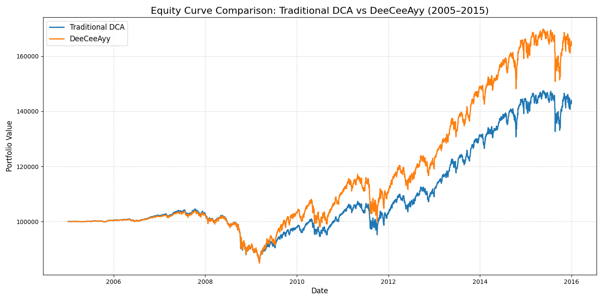

# 📈 Custom DCA Trading Bot

A Python trading bot that dynamically adjusts dollar-cost-averaging (DCA) investments in the S&P 500 (SPY) based on market valuation, using the difference between the S&P 500 index price and its PE ratio as a relative value indicator.

---

## Features

- **Valuation-Aware DCA**: Allocates more capital when the market is "cheap" (by PE ratio), and less when "expensive".
- **Minimum Investment Threshold**: Never invests less than a configurable percentage (e.g., 80%) of the DCA amount, ensuring consistent market exposure even in expensive conditions.
- **Automated Data Fetching**: Dynamically retrieves up-to-date S&P 500 PE ratios and prices.
- **Backtesting Support**: Evaluate strategy performance on historical data.
- **Live Trading Capability**: Integrates with Alpaca for real or paper trading.
- **Configurable Parameters**: Easily adjust DCA amount and valuation sensitivity, and minimum investment threshold.
- **Secure Credentials**: API keys are managed via environment variables or a `.env` file.
- **Robust Logging**: All trades and errors are logged for transparency.

---

## ⚙️ How It Works

1. **Fetches PE Data**  
   Gets current and year-ago S&P 500 PE ratios using dynamic data sources (e.g., Yahoo Finance via `yfinance`or Multpl.com).

2. **Calculates Relative Expensiveness**  
   Compares the year-over-year (YoY) change in index price to the YoY change in PE ratio.

3. **Adjusts Investment Amount**  
   - If the market is relatively cheap (price growth < PE growth), increases DCA.
   - If expensive, decreases DCA, but never below the minimum investment threshold (e.g., 80% of the base DCA amount).

4. **Executes Trades Automatically**  
   Places buy orders for SPY via the Alpaca API at monthly intervals, on the first trading day of each month.
   
---

## ⚖️ How the Bot Uses Market Valuation to Adjust DCA


*Source: [MacroMicro.me](https://www.macromicro.me) – US S&P 500 Price vs. PE Ratio Chart*


The chart above shows the **difference between the S&P 500 index price and its P/E ratio** (blue bars), alongside the actual S&P 500 index level (red line). This difference serves as a **relative valuation signal**.

### 💡 How It Works

The trading bot dynamically adjusts the dollar-cost-averaging (DCA) investment amount based on how expensive or cheap the market appears, using the following principle:

- 📉 **If price growth is less than PE growth**: The market is relatively undervalued → **invest more**
- 📈 **If price growth exceeds PE growth**: The market is relatively overvalued → **invest less**

This prevents over-investing during market exuberance and encourages heavier investment during corrections or undervaluations.

---

## 🔢 What is the Multiplier?

The `multiplier` in the config is a **sensitivity factor** that controls how aggressively the investment amount is adjusted based on valuation.

### For example:

If your base DCA amount is `$500` and the valuation delta is `+0.02`, and your minimum investment threshold is 70%, then:

```python
min_investment = 0.7 * DCA_amount
adjusted_amount = max(DCA_amount - (multiplier * valuation_delta), min_investment)
```

So, if the calculated amount falls below $350, the bot will still invest at least $350.
- A higher multiplier makes the bot more responsive to valuation changes
- A lower multiplier makes it more conservative
- The minimum investment threshold prevents chronic underinvestment

**⚠️ Choose a multiplier that matches your risk tolerance and market outlook**


---
## 🔧 Set Up Instructions

### 1. Clone the Repository
```sh
git clone <your-repo-url>
cd DeeCeeAyy
```

### 2. Install Dependencies
```sh
pip install -r requirements.txt
```

If you use a `.env` file for secrets (recommended), also install:

```sh
pip install python-dotenv
```

### 3. Configure API Keys

Recommended: Use a `.env` file in your project directory:

```sh
ALPACA_API_KEY=your_alpaca_api_key
ALPACA_SECRET_KEY=your_alpaca_secret_key
```

Or, set environment variables in your shell:

```sh
export ALPACA_API_KEY="your_alpaca_api_key"
export ALPACA_SECRET_KEY="your_alpaca_secret_key"
```

**🔒 Important: Never share or commit your API keys or .env file to version control.**

---

## ⚙️ CONFIGURATION

You can modify strategy parameters directly in `tbot.py`:

- multiplier: Controls how much to scale the DCA amount based on valuation delta **(default: 300)**
- DCA_amount: Base dollar amount to invest at each interval **(default: 500)**
- min_investment_pct: The minimum fraction of the DCA amount to invest each month (e.g., 0.7 for 70%). **(default: 0.7)**

These can be adjusted directly in the script or passed when initializing the strategy.

---

## ▶️ RUNNING THE BOT

### 🔁 Backtesting Mode (Recommended for first-time users)

This will simulate trades using historical data.
```sh
python tbot.py
```
<<<<<<< HEAD
- By default, live = False in `tbot.py`, so it will run in backtest mode.
- Backtest period: 1998-01-01 to 2015-12-31 (modifiable in tbot.py)
=======
- By default, live = False in `tbot.py`, so it will run in backtest m  ode.
- Backtest period: 2005-01-01 to 2015-12-31 (modifiable in tbot.py)
>>>>>>> 3363351824d88922d94bca834ef91eebcb28c2bf
- Results: Review logs and output for performance metrics.

### 💹 Live Trading Mode
To enable live trading, edit `tbot.py` and set:
```sh
if __name__ == "__main__":
    live = True
```
Then run:
```sh
python tbot.py
```
**⚠️ Warning: Live trading will place real trades using your Alpaca account.
Always start with paper trading before using real funds.**

---

## 🔐 Security
API keys should be stored in a `.env` file or set as environment variables.

Add `.env` to your `.gitignore` to prevent accidental commits.

Example `.gitignore` entry:

```sh
.env
```

---

## 🛠️ Troubleshooting

| **Issue**                     | **Solution**                                                                 |
|------------------------------|------------------------------------------------------------------------------|
| Missing API Keys             | Ensure your `.env` file or environment variables are set correctly.          |
| Dependency Issues            | Make sure all required packages are installed. Use **Python 3.10** for compatibility with Lumibot. |
| Data Fetch Errors            | Verify your internet connection and ensure the data sources (e.g. Yahoo Finance) are available. |
| yfinance/Benchmark Data Gaps |	If you see missing trades or skipped months, this may be due to Yahoo Finance data gaps. Consider using a more reliable data source for research-grade backtesting.|

---

## 📊 Strategy Performance Comparison
This section summarizes the performance comparison between the Custom DCA Strategy and the Baseline Traditional DCA Strategy based on backtesting results from 2005 to 2015.
The Traditional DCA strategy invests $500 on the first trading day on each month, 
While Custom DCA strategy uses the following parameters:
- **multiplier: 400**
- **DCA_amount: 500**
- **min_investment_pct: 0.8**

### Equity Curve Comparison

*Source: I backtested myself*
The equity curves of both strategies were plotted over the backtest period, showing portfolio value growth over time. The custom DCA strategy generally achieved higher portfolio values, indicating better growth and risk management.

## Key Performance Metrics

| **Metric**               | **Baseline DCA** | **Custom DCA** | **Notes**                                        |
|--------------------------|------------------|----------------|--------------------------------------------------|
| **Total Return**         | 43%              | 64%            | Custom DCA achieved higher total returns         |
| **CAGR**                 | 3.3%             | 4.6%           | Custom DCA had higher annualized returns         |
| **Sharpe Ratio**         | 0.43             | 0.51           | Better risk-adjusted returns for Custom DCA      |
| **Sortino Ratio**        | 0.60             | 0.71           | Custom DCA better at managing downside risk      |
| **Max Drawdown**         | -18.27%          | -18.36%        | Similar drawdown levels                          |
| **Volatility (ann.)**    | 7.92%            | 9.49%          | Baseline DCA slightly less volatile              |
| **Calmar Ratio**         | 0.18             | 0.25           | Custom DCA better return per drawdown            |
| **Recovery Factor**      | 2.14             | 2.96           | Custom DCA recovers faster from drawdowns        |
| **Serenity Index**       | 0.34             | 0.68           | Custom DCA provides smoother performance         |
| **Ulcer Index**          | 0.05             | 0.05           | Similar ulcer index (drawdown severity)          |
| **Longest Drawdown Days**| 1204             | 822            | Custom DCA recovers quicker from losses          |


### Interpretation
- The Custom DCA Strategy outperforms the Baseline DCA in most risk-adjusted metrics, indicating a better balance of return and risk.
- Although the Custom DCA has slightly higher volatility, it compensates with higher returns and faster recovery from drawdowns.
- The Baseline DCA invests a fixed amount consistently, while the Custom DCA adjusts investment amounts based on market valuation, with a minimum investment threshold to avoid underinvestment.

### Conclusion
The Custom DCA strategy provides a superior risk-adjusted return profile compared to the traditional DCA, making it a compelling choice for investors seeking to balance growth and risk.

---

## ⚠️ Disclaimer
**This project is for educational and research purposes only.
It is not financial advice. Use at your own risk.
Past performance does not guarantee future results.**


